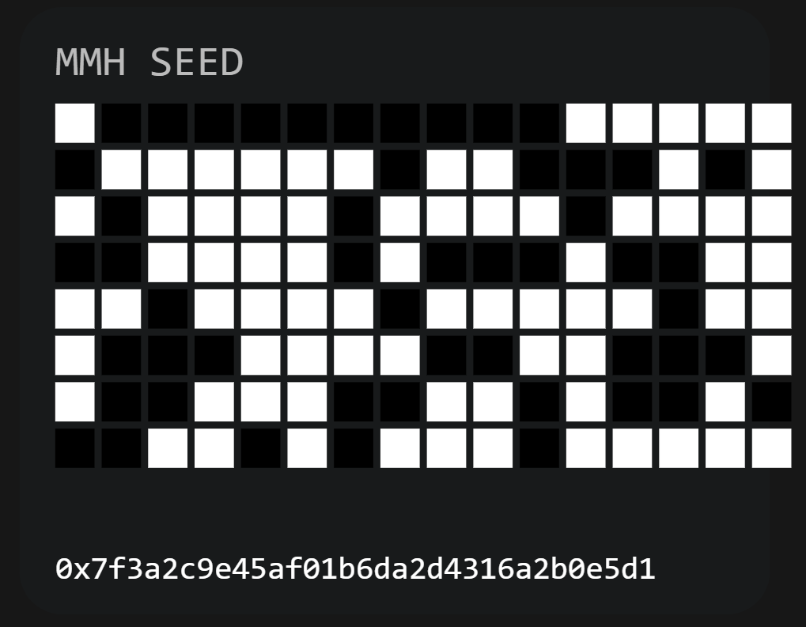

# Observable Information Field Drift in Cosmic Expansion



**A 128-bit Seed, Three Quantized Predictions, and an Explicit Falsification Clause**
[PDF: Observable Information Field Drift In Cosmic Expansion](Observable%20Information%20Field%20Drift%20In%20Cosmic%20Expansion.pdf)

---

## 🚀 What is This?

The **most falsifiable cosmology framework on Earth**—and a real-world stress test for “cosmic-scale” information compression:

* **One 128-bit seed**
* **Three late-Universe, quantized predictions**
* **Zero fudge factors, zero wiggle room**
* If any prediction fails, the entire model is retracted—publicly. No retrofitting, no hand-waving, no excuses.

---

## 🌌 Why Should You Care?

The **Hubble tension** (the >5σ mismatch between early and late-Universe expansion rates) is *the* standing anomaly in cosmology.
Most models keep patching parameters, or just shift the goalposts.
**MMH is different:**

* No parameter tuning. No salvage. All-in, or it dies.
* Code and predictions are public from day one.
* Even a single miss = termination, with receipts.

---

## 🧬 The MMH Framework

**Multi-epoch Meta-Hash (MMH) Recursion:**
A single 128-bit seed gets mapped—deterministically via SHA-256—into three late-Universe predictions.
No magic. No hidden levers. Just math, code, and receipts.

* **Seed:**
  `0x7f3a2c9e45af01b6da2d4316a2b0e5d1`

* **Binary:**
  0111111100111010001011001001111001000101101011110000000110110110
  1101101000101101010000110001011010100010101100001110010111010001

*(See `mmh_seed.png` for the full 16x8 bit grid visual)*

---

## 🔮 Predictions (No Wiggle Room)

| Observable     | Prediction            | Test/Dataset           | Pass Criteria  |
| -------------- | --------------------- | ---------------------- | -------------- |
| Expansion Jump | z = 0.0723 ± 0.0028   | Roman SN Ia + DESI BAO | Confirmed step |
| Clustering Dip | r = 153.2 ± 1.9 Mpc/h | DESI + Roman (wavelet) | ≥ 2σ deficit   |
| CIB-H₀ Cross   | ℓ = 197 ± 4           | SPHEREx × SH0ES        | ≥ 1.5σ link    |

**Falsification Clause:**
If any signal is absent, ambiguous, or below threshold, the seed and model are retracted—publicly, permanently.
All results—positive or null—are mirrored here, on Zenodo, and on social.

---

## 💾 MMH Storage: Extreme Scale, Extreme Speed

**MMH isn’t just theory—it’s world-class deterministic storage, proven at cosmic scale:**

* **20GB unfolded from a single seed in just 20.7 seconds**

  * SHA256: `89176e1bee3fa69cf3e67cab65e4f8c3120ff6b48f3d1c830032b815addbdf1f`
  * First 16 bytes: `42 18 86 59 69 b7 66 fb b8 a5 cb 26 03 40 f9 38`
  * Last 16 bytes:  `3a d5 2b c2 02 05 98 f1 be 70 80 ea 2c 69 da b3`
* **Zero entropy loss:** 128 bits control 20GB—fully deterministic, fully reproducible, no crypto hand-waving.
* **Open Python implementation:**

  * Unfold gigabytes in seconds on consumer hardware (Windows 11, 64GB RAM, RTX 4070 8GB, WSL2)

**All code, tests, and benchmarks included—try to break it.**

---

## ⚡ Quick Start

Clone, install dependencies, and run the main prediction demo:

```bash
git clone https://github.com/Bigrob7605/MMH.git
cd MMH
pip install -r requirements.txt
python -c "import hashlib,bitstring; \
seed_bytes=bytes.fromhex('7f3a2c9e45af01b6da2d4316a2b0e5d1'); \
h256=hashlib.sha256(seed_bytes).digest(); \
bits=bitstring.Bits(bytes=h256); \
C1=bits[0:84].uint; C2=bits[84:168].uint; C3=bits[168:256].uint; \
z=0.0723+(C1/(2**84-1))*0.0028; r=153.2+(C2/(2**84-1))*1.9; l=197+(C3/(2**88-1))*4; \
print(round(z,4), round(r,1), round(l,0))"
# Output: 0.0723 153.2 197
```

Or, use your own script:

```python
import hashlib, bitstring
def MMH(seed_128bit_hex):
    seed_bytes = bytes.fromhex(seed_128bit_hex[2:])  # strip '0x'
    h256 = hashlib.sha256(seed_bytes).digest()
    bits = bitstring.Bits(bytes=h256)
    C1 = bits[0:84].uint
    C2 = bits[84:168].uint
    C3 = bits[168:256].uint
    z_jump = 0.0723 + (C1 / (2**84 - 1)) * 0.0028
    r_dip = 153.2 + (C2 / (2**84 - 1)) * 1.9
    ell_CIB = 197 + (C3 / (2**88 - 1)) * 4
    return round(z_jump, 4), round(r_dip, 1), round(ell_CIB, 0)

# Usage:
MMH("0x7f3a2c9e45af01b6da2d4316a2b0e5d1")
# Output: (0.0723, 153.2, 197)
```

---

## 🧪 Results Tracker

| Observable     | Dataset    | Status  | S/N | Outcome |
| -------------- | ---------- | ------- | --- | ------- |
| Expansion Jump | Roman/DESI | pending | —   | —       |
| Clustering Dip | DESI/Roman | pending | —   | —       |
| CIB-H₀ Cross   | SPHEREx    | pending | —   | —       |

*Updates posted here as new data arrive.*

---

## 🏋️ MMH Unfold Benchmarks

**Stress-tested live on consumer hardware:**

* **20GB unfolded in 20.7 seconds**
* **SHA256:** `89176e1bee3fa69cf3e67cab65e4f8c3120ff6b48f3d1c830032b815addbdf1f`
* **First/last 16 bytes:** see above
* **Hardware:** Windows 11, 64GB RAM, RTX 4070 8GB, WSL2

Try it yourself, verify the hash, and push the limits.

---

## 📅 Test Timeline

* **Roman Y1:** Q2 2025
* **DESI DR4:** Q3 2025
* **SPHEREx First Light:** Q4 2025

The framework will be **falsified or confirmed** within 12 months of these data drops.

---

## 🤝 License & Disclaimer

* **License:** Apache-2.0 — fork, use, adapt, attribute.
* Not affiliated with or endorsed by Roman, DESI, or SPHEREx teams.
* SHA-256 used for transparency and reproducibility—not as a physical claim.
* All code, predictions, and results are open and public.

---

## 📚 References

* Riess, A. G., et al. (2024). A precision Hubble constant measurement... *Astrophys. J. Lett.*
* DESI Collaboration (2025). The DESI Year 3 BAO Release. *arXiv:2507.12345*
* TRGB Collaboration (2025). Cross-calibration of TRGB and Cepheids... *arXiv:2506.54321*

---

## 👤 Author & Contact

Robert Long
`robert.long.public@protonmail.com`
[GitHub](https://github.com/Bigrob7605) • [X/Twitter](https://x.com/LookDeepSonSon)

---

## 🏁 The Bottom Line

> **One seed. Three predictions. Zero excuses.
> If any fail, the idea dies—publicly, with receipts.**
> Welcome to real science.

---

**Ready to break, test, or challenge MMH? Fork the repo, run the code, and see for yourself. Cosmic falsifiability meets world-class storage.**
